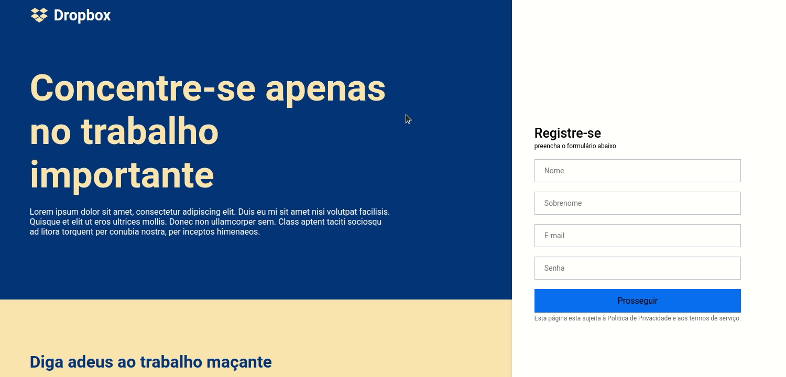

<h1 align="center">
UI Clone 
</h1>

Responsive Dropbox Homepage UI clone made following the <a href="https://www.youtube.com/watch?v=VqP1ECc_j4M)">Guilherme Rodz Youtube video</a>.

  
<h3 align="center"><a  href="https://clone-dropbox-bernardosv.netlify.app/">🔗 Deploy</a></h3>

## ⚙️ Techs

- [x] React.js
- [x] Styled Components
- [x] TypeScript

## 🚀 Running

1.  `npm install` or `yarn install`. 
2.  `yarn start`. 
